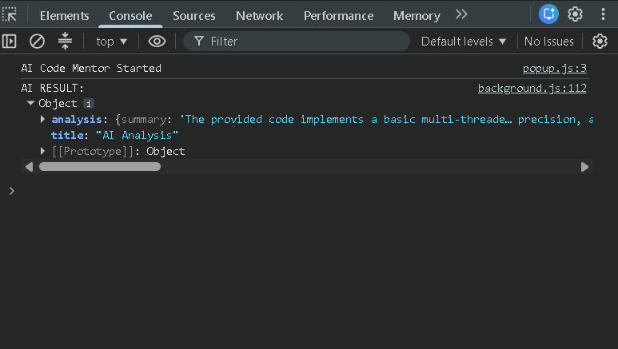
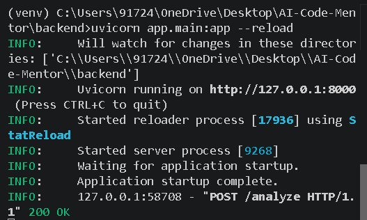
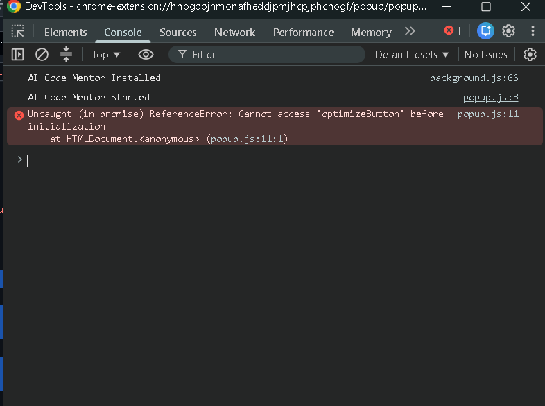
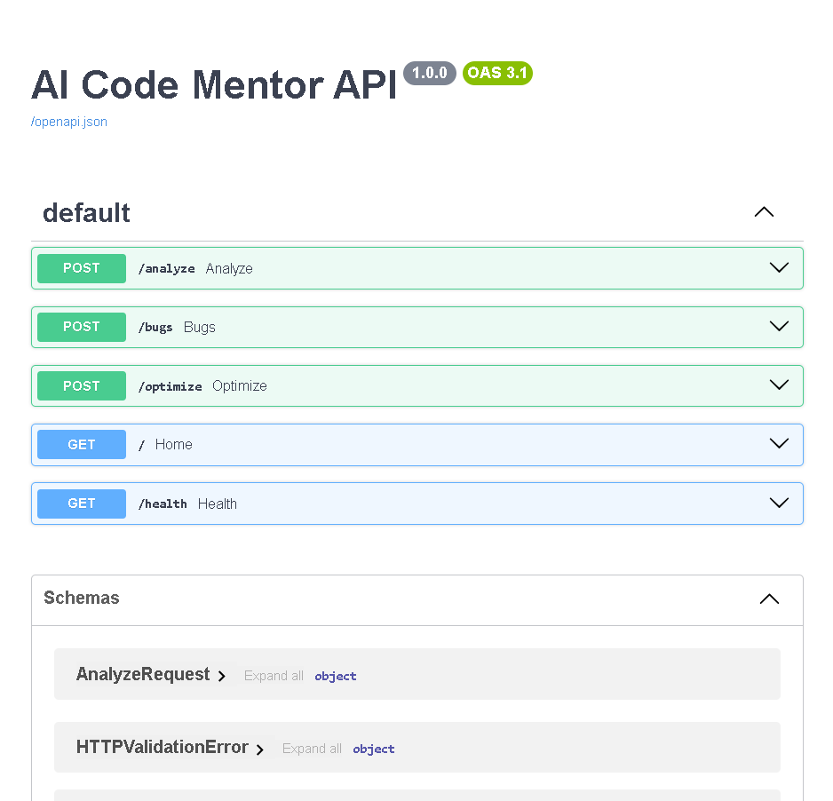
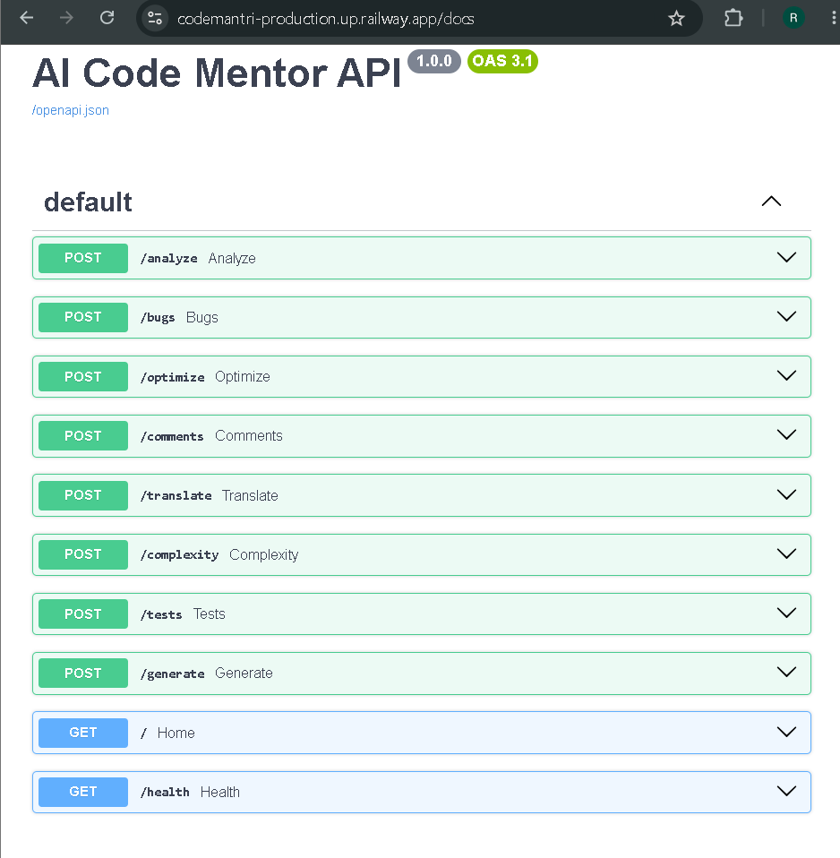
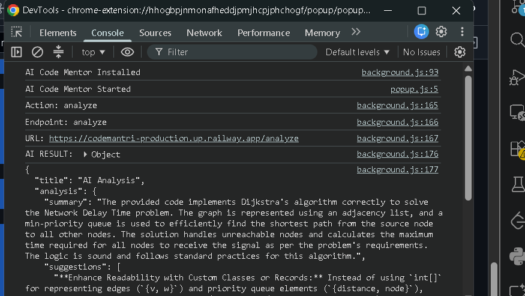

# 🤖 AI Code Mentor

> An AI-powered Chrome Extension that helps developers understand, improve, and solve code directly from websites like GitHub, LeetCode, GeeksforGeeks, and CodeChef.


---

## 🚀 Features

### 📖 Explain Code
- AI-generated code explanation
- Time & Space Complexity
- Improvement suggestions

### 🐞 Find Bugs
- Detect logical bugs
- Severity analysis
- Suggested fixes

### ⚡ Optimize Code
- Performance improvements
- Memory optimization
- Best practices
- View optimized code separately

### 💬 Generate Comments
- Professional inline comments
- Improves code readability

### 🔄 Translate Code
- Convert code between programming languages
- Maintain original logic

### 📊 Complexity Analysis
- Time Complexity
- Space Complexity
- Algorithm explanation

### 🧪 Generate Unit Tests
- AI-generated test cases
- Edge cases
- Standard testing framework

### 💡 Solve Problem
Generates:

- Brute Force Solution
- Better Solution
- Optimal Solution

For every solution it provides:

- Explanation
- Algorithm
- Time Complexity
- Space Complexity
- Interview Tips
- Code Viewer

### 💻 Code Viewer
- Dedicated popup for generated code
- Copy code instantly
- Clean UI for better readability

---

# 🛠️ Tech Stack

## Frontend
- JavaScript
- HTML5
- CSS3
- Chrome Extension API

## Backend
- Python
- FastAPI
- Google Gemini API

## Deployment
- Railway

---

# 📂 Project Structure

```
AI-Code-Mentor
│
├── backend
│   ├── app
│   │   ├── api
│   │   ├── ai
│   │   ├── prompts
│   │   ├── schemas
│   │   └── main.py
│   │
│   ├── requirements.txt
│   └── .env
│
├── extension
│   ├── popup
│   ├── background.js
│   ├── content.js
│   ├── manifest.json
│   └── assets
│
├── screenshots
│
└── README.md
```

---

# ⚙️ Installation

## 1️⃣ Clone Repository

```bash
git clone https://github.com/YOUR_USERNAME/AI-Code-Mentor.git

cd AI-Code-Mentor
```

---

## 2️⃣ Backend Setup

```bash
cd backend

python -m venv venv
```

Activate Virtual Environment

### Windows

```bash
venv\Scripts\activate
```

### Linux / macOS

```bash
source venv/bin/activate
```

Install dependencies

```bash
pip install -r requirements.txt
```

Create `.env`

```env
GEMINI_API_KEY=YOUR_GEMINI_API_KEY
```

Run server

```bash
uvicorn app.main:app --reload
```

Server runs on

```
http://127.0.0.1:8000
```

Swagger

```
http://127.0.0.1:8000/docs
```

---

## 3️⃣ Chrome Extension

Open

```
chrome://extensions
```

Enable

```
Developer Mode
```

Click

```
Load Unpacked
```

Select

```
extension/
```

---

# 🌍 Live Backend

**Render Deployment**

```
https://code-mantri.onrender.com
```

Swagger Documentation

```
https://code-mantri.onrender.com/docs
```

---

# 📸 Screenshots

## 🏠 Extension Home

The main popup interface of AI Code Mentor with all available AI-powered features.

<p align="center">
    
</p>

---

## 💻 Code Selection

Selecting source code directly from GitHub, LeetCode, GeeksforGeeks, or other supported websites.

<p align="center">
    
</p>

---

## 🤖 AI Response

AI-generated explanation including summary, suggestions, complexity analysis, and formatted output.

<p align="center">
    
</p>

---

## 🚀 Backend Running

FastAPI backend running locally during development.

<p align="center">
    
</p>

---

## 📚 Swagger API

Interactive API documentation generated by FastAPI.

<p align="center">
    
</p>

---

## ✅ Live Testing

Testing the deployed AI Code Mentor extension with the Railway backend.

<p align="center">
    
</p>

---

# 🎯 Future Improvements

- Dry Run Visualization
- Syntax Highlighting
- Download Code
- Multiple AI Models
- Code History
- Authentication
- Dark / Light Theme

---

# 🤝 Contributing

Contributions are welcome!

1. Fork the repository
2. Create a feature branch

```bash
git checkout -b feature-name
```

3. Commit changes

```bash
git commit -m "Added feature"
```

4. Push

```bash
git push origin feature-name
```

5. Create a Pull Request

---

# 📄 License

This project is licensed under the MIT License.

---

# 👨‍💻 Author

**Hemant Sharma**

GitHub:
https://github.com/Hemant-Sharma-22

LinkedIn:
https://www.linkedin.com/in/YOUR-LINKEDIN

---

⭐ If you like this project, don't forget to Star the repository!
